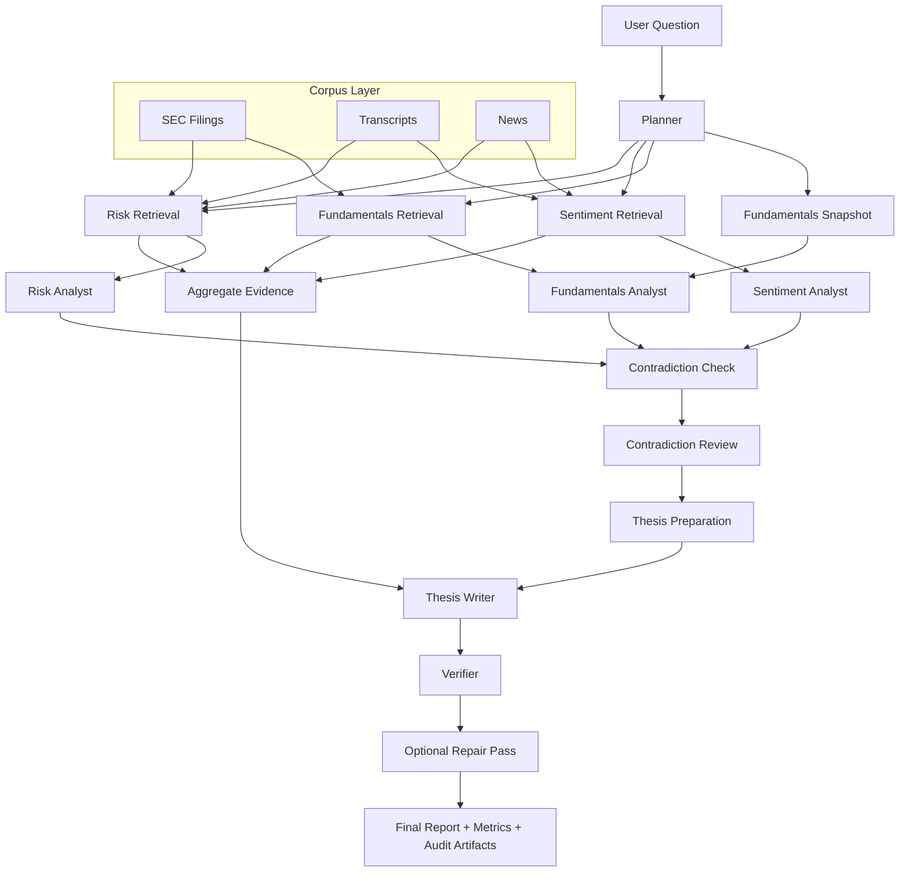

<div align="center">

# Quant Agentic RAG

**LangGraph-powered agentic RAG system for equity research with hybrid retrieval, grounded thesis generation, and evaluation-driven reliability**

[](https://www.python.org/downloads/release/python-3120/)
[](https://fastapi.tiangolo.com/)
[](https://www.langchain.com/langgraph)
[](https://www.postgresql.org/)
[](https://github.com/pgvector/pgvector)

</div>

## Overview

`Quant Agentic RAG` is an applied LLM system for financial research.
It is built around a practical question: how do you turn stock-analysis prompting into a system that is ingestible, traceable, testable, and auditable under real retrieval and grounding constraints?

The repository combines:

- source ingestion for filings, transcripts, and news
- metadata-rich chunking and embedding pipelines
- hybrid retrieval with finance-aware query planning
- specialist analyst workflows for fundamentals, sentiment, and risk
- grounded thesis synthesis with inline source citations
- deterministic verification, contradiction review, and repair
- telemetry, audit persistence, and offline release-gate evaluation

The project is best understood as a controlled agentic workflow rather than an open-ended autonomous agent. That design choice is deliberate: financial analysis benefits more from evidence control, provenance, and measurable behavior than from unrestricted tool use.

## Current Status

The project currently supports:

- SEC filing ingestion with section extraction and normalized document storage
- Alpha Vantage transcript ingestion with speaker-aware parsing
- Alpha Vantage news ingestion with relevance, publisher, and sentiment metadata
- chunk-level indexing with OpenAI embeddings persisted in Postgres-backed tables
- native `pgvector` semantic retrieval for Postgres / Supabase deployments
- analyst-specific retrieval policies for fundamentals, sentiment, and risk
- hybrid retrieval with metadata prefilters, lexical search, semantic search, reciprocal rank fusion, reranking, freshness scoring, diversity controls, and neighboring chunk expansion
- structured analyst outputs with typed findings and evidence ids
- cross-analyst contradiction detection and contradiction review
- thesis-preparation logic that deterministically maps findings into report sections
- grounding verification against structured `evidence_ids`
- a single verifier-driven repair pass for unsupported output cleanup
- per-node LLM telemetry including token usage, latency, retry counts, timeout counts, model metadata, and estimated cost
- FastAPI delivery, CLI workflows, audit persistence, and thesis artifact storage

Recent system hardening work also introduced:

- offline golden-set evaluation and release-gate aggregation
- retrieval metrics such as `precision@k`, `recall@k`, and off-ticker evidence rate
- stricter deterministic checks for malformed citations and uncited numeric claims
- contradiction surfacing metrics and repair-pass tracking
- Supabase migration support for shared registry and retrieval schema evolution

## System Overview



## Key Features

- **Controlled agentic workflow** using LangGraph state orchestration rather than a single opaque prompt.
- **Profile-aware hybrid retrieval** that treats filings, transcripts, and news as different evidence surfaces with different policies.
- **Typed intermediate reasoning artifacts** so analysts emit findings, evidence ids, confidence, and evidence gaps instead of only prose.
- **Grounded synthesis contract** where the thesis writer works from a prepared evidence packet and exact citation syntax.
- **Deterministic reliability checks** for unsupported findings, malformed citations, and uncited numeric claims.
- **Contradiction handling** that surfaces disagreement across specialist analysts instead of collapsing conflicting evidence into one narrative.
- **Evaluation-driven iteration** with golden-set cases, release gates, retrieval metrics, and repair-pass tracking.
- **Operational visibility** through telemetry, audit records, storage metadata, and cost estimation.

## Architecture

The system is organized into five main layers.

### 1. Ingestion and normalization

- `SEC filings`: raw filings are downloaded, normalized, and split into section-aware document records.
- `Transcripts`: earnings calls are parsed into speaker turns with role metadata preserved.
- `News`: articles are normalized with sentiment, publisher, and relevance metadata.

Each normalized document is represented with stable provenance fields so the retrieval and verification stack can trace claims back to source material.

### 2. Chunking and indexing

- filings are chunked at the section level
- transcripts are chunked by speaker turn
- news is chunked at compact article level
- embeddings are generated in a separate indexing pipeline
- chunk embeddings are stored independently from normalized documents

This separation matters because ingestion, normalization, and embedding/indexing have different operational costs and failure modes.

### 3. Retrieval

Retrieval is not generic vector search.
Each analyst profile applies domain-aware query planning and filtering.

Retrieval flow:

1. rewrite the user question for retrieval
2. decompose into finance-specific subqueries
3. prefilter by metadata
4. run lexical and semantic search
5. fuse ranked lists with reciprocal rank fusion
6. rerank the top candidate pool
7. enforce source diversity and freshness preferences
8. optionally attach neighboring chunks for local context

Retrieval metadata includes:

- ticker and document type
- form type and filing section
- publication time and freshness windows
- speaker role and publisher
- sentiment and news relevance metadata

### 4. Specialist reasoning

The workflow uses three specialist analysis roles:

- `fundamentals`
- `sentiment`
- `risk`

Each analyst receives a scoped evidence bundle rather than the full merged corpus.
That improves relevance and keeps financial reasoning tasks separated by evidence type.

### 5. Synthesis and verification

The final report is not generated directly from raw retrieval output.
Instead the system:

1. structures analyst findings
2. detects contradictions
3. prepares thesis sections deterministically
4. synthesizes a grounded investment thesis
5. verifies citation and grounding behavior
6. runs one repair pass if needed

This design reduces unsupported generation and creates a measurable contract between retrieval, reasoning, and output quality.

## Evaluation and Reliability

The evaluation stack is designed around system behavior, not only model aesthetics.

Current evaluation coverage includes:

- deterministic grounding regression tests
- offline golden-set evaluation
- release-gate thresholds
- retrieval `precision@k`
- retrieval `recall@k`
- off-ticker evidence rate
- unsupported numeric claim rate
- contradiction surfacing rate
- pass rate after repair

Deterministic verifier checks currently enforce:

- exact inline citation syntax: `[source:<id>]`
- no malformed citation variants
- no uncited numeric claims
- no placeholder grounding text
- limits on unsupported and partially grounded findings

This keeps the project focused on measurable system quality rather than prompt-only safeguards.

## Quickstart

Using [`uv`](https://github.com/astral-sh/uv) is recommended.

```bash
git clone https://github.com/danielmtzbarba/quant-agentic-rag.git
cd quant-agentic-rag
uv sync --extra dev
```

Copy `.env.example` to `.env` and configure the providers you plan to use:

- `OPENAI_API_KEY`
- `OPENAI_MODEL_NAME`
- `OPENAI_EMBEDDING_MODEL`
- `OPENAI_EMBEDDING_DIMENSIONS`
- `VANTAGE_API_KEY`
- `DATABASE_URL`

Run a one-off research workflow:

```bash
uv run stock-agent-rag research \
  --ticker NVDA \
  --question "Generate an evidence-backed investment thesis."
```

## Documentation

Project documentation lives in `docs/`:

- [AI System Design](docs/AI_SYSTEM_DESIGN.md)
- [Workflow](docs/WORKFLOW.md)
- [Evaluation](docs/EVALUATION.md)
- [SEC Ingestion](docs/SEC_INGESTION.md)
- [Transcript Ingestion](docs/TRANSCRIPT_INGESTION.md)
- [News Ingestion](docs/NEWS_INGESTION.md)
- [News Relevance Scoring](docs/NEWS_RELEVANCE_SCORING.md)
- [Thesis Artifacts](docs/THESIS_ARTIFACTS.md)
- [Vector Databases](docs/VECTOR_DATABASES.md)
- [Supabase Migrations](docs/SUPABASE_MIGRATIONS.md)

These docs cover the architecture and subsystem decisions as they exist in the repository today.

## Repository Layout

`quant-agentic-rag/` is organized into a few main layers:

- `src/stock_agent_rag/workflow.py`
  LangGraph workflow definition, node contracts, thesis generation, verification, and repair.

- `src/stock_agent_rag/retrieval.py`
  Query planning, hybrid retrieval, reranking, freshness handling, diversity controls, and neighbor expansion.

- `src/stock_agent_rag/ingestion/`
  SEC, transcript, and news ingestion pipelines.

- `src/stock_agent_rag/indexing.py`
  Chunk embedding pipeline and indexing-run tracking.

- `src/stock_agent_rag/service.py`
  Workflow execution wrapper, aggregation of metrics, audit integration, and thesis artifact persistence.

- `src/stock_agent_rag/api.py`
  FastAPI delivery surface.

- `src/stock_agent_rag/cli.py`
  CLI entrypoints for research runs, ingestion, indexing, and release-gate evaluation.

- `src/stock_agent_rag/db.py`
  SQLAlchemy models for documents, chunks, embeddings, runs, and persisted artifacts.

- `tests/`
  Regression coverage for retrieval, verification, ingestion, evaluation, telemetry, and graph behavior.

- `supabase/migrations/`
  Schema migrations for the registry and retrieval stack.

- `docs/`
  Technical design and subsystem documentation.

## Configuration

Key runtime configuration areas include:

- retrieval candidate pool and rerank limits
- neighbor expansion budget
- profile-specific freshness windows
- embedding dimensions
- verifier thresholds for unsupported findings
- default top-k values

## Running The System

### One-off research run

```bash
uv run stock-agent-rag research \
  --ticker NVDA \
  --question "Generate an evidence-backed investment thesis."
```

### Run the API

```bash
uv run stock-agent-rag serve --host 0.0.0.0 --port 8000
```

### Database initialization

```bash
uv run stock-agent-rag db-init
```

## Ingestion Workflows

### SEC filings

```bash
uv run stock-agent-rag ingest-sec \
  --ticker NVDA \
  --form-type 10-K \
  --limit 1
```

### Earnings transcripts

```bash
uv run stock-agent-rag ingest-transcript \
  --ticker NVDA \
  --year 2025 \
  --quarter 4
```

### News

```bash
uv run stock-agent-rag ingest-news \
  --ticker NVDA \
  --limit 20
```

### Chunk indexing

```bash
uv run stock-agent-rag index-chunks --ticker NVDA
```

## Evaluation

### Run targeted tests

```bash
uv run pytest tests/test_graph.py tests/test_hybrid_retrieval.py tests/test_evaluation.py
```

### Run release-gate evaluation

```bash
uv run stock-agent-rag release-gates --results path/to/results.json
```

## Interview-Relevant Scope

This repository is a strong fit for discussions around:

- LLM system design
- agentic workflow orchestration
- RAG architecture
- retrieval evaluation
- grounding and verification
- observability and auditability
- converting prototypes into measurable systems

It is a weaker fit for claims around:

- high-scale distributed serving
- institutional-grade financial data quality
- fully autonomous agents with dynamic long-horizon planning

## Known Boundaries

- `yfinance` is used as a convenient fundamentals snapshot source during prototyping.
- Alpha Vantage is sufficient for experimentation but not the strongest production data provider.
- The workflow is a fixed graph with controlled repair rather than a fully adaptive autonomous agent.
- Evaluation is strong on grounding and retrieval behavior, but still weaker on human preference and online impact measurement.
- The project is optimized for reliability and inspectability, not unconstrained autonomy.
