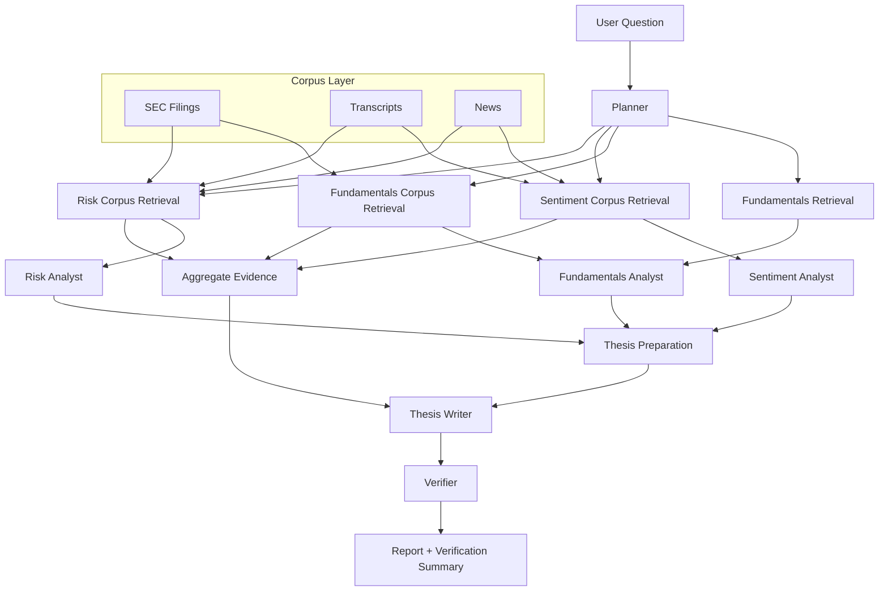

# Quant Agentic RAG

Production-oriented agentic RAG system for equity research.

This project is built around a practical question: how do you turn LLM-based stock analysis from a prompt demo into a system that is ingestible, traceable, testable, and auditable?

The current implementation includes:

- SEC filing ingestion with section extraction
- Alpha Vantage transcript ingestion with speaker-aware parsing
- Alpha Vantage news ingestion with publisher and sentiment metadata
- analyst-specific retrieval policies
- hybrid retrieval with metadata prefilters, lexical search, semantic embeddings, RRF fusion, and reranking
- financial retrieval with document-aware chunk units, query rewriting, multi-query decomposition, freshness scoring, and source diversity controls
- neighboring chunk expansion for compact local context support
- structured analyst outputs
- verification that checks report grounding against structured `evidence_ids`
- per-node LLM telemetry with token usage, latency, and model metadata
- FastAPI delivery, Postgres registry metadata, and Supabase SQL migrations
- separate chunk-indexing pipeline that persists embeddings in Postgres-backed index tables
- native pgvector column and cosine-distance search path for Postgres / Supabase deployments

## System Overview



## Current Workflow

1. `planner`
Creates a compact execution plan from the ticker and user question.

2. `fundamentals_retrieval`
Fetches structured fundamentals from `yfinance` for prototyping.

3. `fundamentals_corpus_retrieval`
Retrieves filing-heavy evidence for the fundamentals analyst.

4. `sentiment_corpus_retrieval`
Retrieves transcript + news evidence for the sentiment analyst.

5. `risk_corpus_retrieval`
Retrieves filing + news + transcript evidence for the risk analyst.

6. `aggregate_evidence`
Merges and deduplicates the analyst-specific evidence pools.

7. `fundamentals_analyst`
Returns structured fundamentals analysis.

8. `sentiment_analyst`
Returns structured sentiment analysis.

9. `risk_analyst`
Returns structured risk analysis.

10. `thesis_preparation`
Buckets structured findings into explicit report sections before synthesis.

11. `thesis`
Builds the final investment thesis from prepared thesis sections and the merged evidence pool.

12. `verifier`
Checks:
- report citation coverage against retrieved sources
- grounding of structured findings against cited `evidence_ids`
- missing-data flags and unsupported findings

## Implemented Capabilities

### Corpus ingestion

- SEC ingestion writes raw filings, normalized documents, and section-level chunks.
- Transcript ingestion writes raw provider payloads, normalized transcript documents, and speaker-aware chunks.
- News ingestion writes raw feed payloads, normalized article documents, and sentiment-aware news chunks.
- Ingestion does not build embeddings inline.
- A separate indexing pipeline reads persisted chunks and writes retrieval embeddings into dedicated index tables.

### Retrieval and agent specialization

- Each specialist agent uses a different retrieval profile instead of sharing one generic evidence bundle.
- Retrieval is document-aware rather than generic-chunk-first:
  - filings are retrieved as section-derived chunks
  - transcripts are retrieved as speaker-turn-derived chunks
  - news is retrieved as article-derived chunks
- Retrieval rewrites the question into a retrieval-oriented query and decomposes it into multiple finance-specific subqueries.
- Typical decomposition covers themes like:
  - growth
  - margins
  - guidance
  - risk factors
  - regulation
- Retrieval prefilters by metadata:
  - ticker
  - document type
  - form type
  - section
  - recency window
  - publisher / speaker role
- First-stage retrieval runs lexical and semantic searches in parallel.
- Candidate lists are fused with reciprocal rank fusion (`RRF`).
- Top fused candidates are reranked before evidence is returned.
- Freshness-aware scoring favors:
  - news within profile-specific windows:
    - sentiment: last 14 days
    - risk: last 30 days
  - latest-quarter transcripts first
  - latest 10-K / 10-Q filings first, with recency weighting
- Source diversity controls keep near-duplicate news from crowding out filings and transcripts.
- Neighboring chunks can be added around selected primary chunks to preserve local context.
- Fundamentals retrieval prefers filings and financial sections.
- Sentiment retrieval prefers transcripts and fresh news.
- Risk retrieval prioritizes risk-factor sections plus recent adverse evidence.

### Structured reasoning

- Analysts return typed findings with:
  - `finding`
  - `evidence_ids`
  - `confidence`
  - `missing_data`
  - optional `finding_type`
- Thesis generation consumes structured analyst outputs.
- Thesis preparation maps structured findings into explicit report sections.
- Verification checks whether final report citations actually support those structured findings.

### Runtime and delivery

- FastAPI API
- CLI for ingestion and research runs
- Rich logging locally, `logfmt` in production-style environments
- request IDs in middleware
- Dockerfile
- Postgres registry metadata
- Postgres-backed chunk embedding index
- Supabase SQL migrations in a dedicated `rag` schema
- per-node telemetry for:
  - token usage
  - latency
  - model/provider/temperature metadata
  - retry counts
  - timeout counts
  - estimated node cost
- per-run totals for:
  - input tokens
  - output tokens
  - total tokens
  - estimated run cost
  - retrieval hit-rate summaries
  - retrieval freshness summaries
  - retrieval diversity summaries
- structured retrieval-stage logs for:
  - query planning
  - subquery execution
  - fusion
  - reranking
  - diversity filtering
  - final selection

## Repository Layout

```text
quant-agentic-rag/
  docs/
  data/
  supabase/
    config.toml
    migrations/
  src/stock_agent_rag/
    api.py
    cli.py
    config.py
    db.py
    ingestion/
      news.py
      sec.py
      transcripts.py
    logging.py
    middleware.py
    prompts.py
    registry.py
    schemas.py
    service.py
    tools.py
    workflow.py
  tests/
  README.md
  pyproject.toml
```

## Quickstart

### 1. Environment

Copy `.env.example` to `.env` and fill in the keys you plan to use:

- `OPENAI_API_KEY`
- `OPENAI_EMBEDDING_MODEL`
- `OPENAI_EMBEDDING_DIMENSIONS`
- `VANTAGE_API_KEY`
- `DATABASE_URL`

### 2. Install

```bash
uv sync --extra dev
```

### 3. Apply schema migrations

Database schema for this repo is managed under [supabase/migrations](/home/danielmtz/Projects/agentic-rag/quant-agentic-rag/supabase/migrations).

Schema ownership is:

- `core`: owned by `mt5-quant-server`
- `rag`: owned by this repo

If you need to run Supabase migrations across both repositories, use the merged bundle workflow
documented in [docs/SUPABASE_MIGRATIONS.md](/home/danielmtz/Projects/agentic-rag/quant-agentic-rag/docs/SUPABASE_MIGRATIONS.md).

Example:

```bash
uv run stock-agent-rag bundle-supabase \
  --core-repo /home/danielmtz/Projects/algotrading/mt5-quant-server \
  --output-dir /tmp/quant-supabase-bundle
```

Then run Supabase from the generated bundle:

```bash
cd /tmp/quant-supabase-bundle
supabase db push
```

Or do both steps in one command:

```bash
uv run stock-agent-rag bundle-supabase \
  --core-repo /home/danielmtz/Projects/algotrading/mt5-quant-server \
  --output-dir /tmp/quant-supabase-bundle \
  --project-ref YOUR_PROJECT_REF \
  --push
```

### 4. Start the API

```bash
uv run stock-agent-rag serve
```

### 5. Run a research job

```bash
uv run stock-agent-rag research --ticker NVDA --question "Generate an evidence-backed investment thesis."
```

### 6. Index chunk embeddings

Semantic retrieval needs persisted chunk embeddings in the registry database.

```bash
uv run stock-agent-rag index-chunks --ticker NVDA
```

Use `--force` to rebuild existing embeddings:

```bash
uv run stock-agent-rag index-chunks --ticker NVDA --force
```

On Postgres/Supabase, semantic retrieval prefers the native `pgvector` column and index.
Local SQLite and test environments fall back to the persisted JSON embedding payload.

## Ingestion Commands

### SEC

```bash
uv run stock-agent-rag ingest-sec --ticker NVDA --form-type 10-K --limit 1
```

### Transcript

```bash
uv run stock-agent-rag ingest-transcript --ticker NVDA --year 2026 --quarter 1
```

### News

```bash
uv run stock-agent-rag ingest-news --ticker NVDA --limit 20
```

## API

Available endpoints:

- `GET /healthz`
- `POST /v1/research`

Example:

```bash
curl -X POST http://localhost:8000/v1/research \
  -H "content-type: application/json" \
  -d '{
    "ticker": "NVDA",
    "question": "Generate an evidence-backed investment thesis."
  }'
```

Response fields include:

- `plan`
- `report`
- `verification_status`
- `verification_summary`
- `retrieved_sources`
- `token_usage`
- `model_metadata`
- `runtime_metrics`
- `retrieval_metrics`
- `estimated_cost_usd`
- `latency_ms`

## Storage Model

### Filesystem

The corpus source of truth is currently file-based:

- `data/raw/...`
- `data/normalized/...`
- `data/chunks/...`

### Postgres

Postgres is used as the registry and control plane:

- `ingestion_runs`
- `documents`
- `chunks`
- `source_registry`
- `research_runs`

Schema ownership is managed by Supabase SQL migrations in this repo under the `rag` schema.

`research_runs` persists:

- final report artifacts
- structured analyst outputs
- thesis preparation artifacts
- verifier metrics
- per-node telemetry
- per-run token totals
- model metadata
- runtime retry/timeout metrics
- retrieval hit-rate and freshness metrics
- estimated run cost

### Planned future stores

- vector database for hybrid retrieval
- InfluxDB for candle data from MetaTrader 5

## Logging

Supported modes:

- `LOG_FORMAT=rich`
- `LOG_FORMAT=logfmt`
- `LOG_FORMAT=hybrid`
- `LOG_FORMAT=auto`

`auto` resolves to Rich in local/dev and `logfmt` elsewhere.

## Testing

```bash
uv run pytest
uv run ruff check .
```

Current test coverage includes:

- API behavior
- research audit persistence
- registry behavior
- SEC ingestion
- transcript ingestion
- news ingestion
- retrieval policies
- thesis preparation
- verifier grounding logic

## Documentation

- [docs/WORKFLOW.md](docs/WORKFLOW.md)
- [docs/AI_SYSTEM_DESIGN.md](docs/AI_SYSTEM_DESIGN.md)
- [docs/SEC_INGESTION.md](docs/SEC_INGESTION.md)
- [docs/TRANSCRIPT_INGESTION.md](docs/TRANSCRIPT_INGESTION.md)
- [docs/NEWS_INGESTION.md](docs/NEWS_INGESTION.md)
- [docs/POSTGRES_REGISTRY.md](docs/POSTGRES_REGISTRY.md)
- [docs/VECTOR_DATABASES.md](docs/VECTOR_DATABASES.md)
- [docs/AGENT_FUNDAMENTALS.md](docs/AGENT_FUNDAMENTALS.md)
- [docs/AGENT_SENTIMENT.md](docs/AGENT_SENTIMENT.md)
- [docs/AGENT_RISK.md](docs/AGENT_RISK.md)
- [docs/ROADMAP.md](docs/ROADMAP.md)
- [docs/EVALUATION.md](docs/EVALUATION.md)

## Current Status

What is production-oriented already:

- typed workflow state
- repeatable ingestion pipelines
- raw/normalized/chunked corpus boundaries
- dedicated registry schema and migrations
- source-aware retrieval policies
- structured intermediate outputs
- deterministic grounding checks in verification
- fail-closed verifier thresholds
- persisted research-run artifacts for auditability

What is still intentionally prototype-level:

- `yfinance` fundamentals
- lexical local retrieval instead of hybrid/vector retrieval
- no reranker yet
- no offline eval dashboard yet
- no production deployment manifests yet

## Next Best Steps

1. Make thesis generation map more explicitly from structured findings to final report sections.
2. Add fail-closed verifier rules based on unsupported finding thresholds.
3. Persist structured analyst outputs for auditability and evaluations.
4. Replace local lexical search with hybrid retrieval plus reranking.
5. Add a golden-set evaluation harness.
