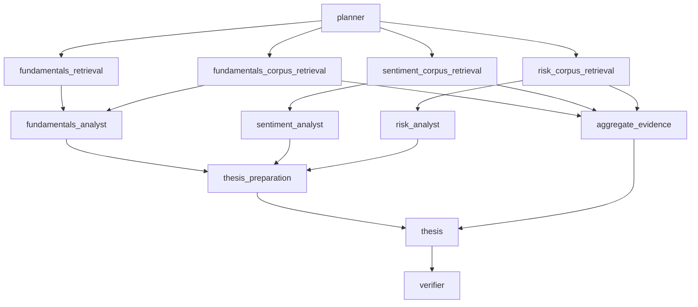

# Workflow

## Purpose

This document describes the current agent workflow node by node, including the input state each node depends on, the output keys it writes, and the role it plays in the overall system.

The workflow is implemented in [src/stock_agent_rag/workflow.py](../src/stock_agent_rag/workflow.py).

## High-Level Flow

## State Contract

The workflow runs over `ResearchState`, which currently includes:

- request inputs:
  - `ticker`
  - `question`
- shared context:
  - `plan`
  - `fundamentals`
  - `retrieved_evidence`
- analyst-specific evidence:
  - `fundamentals_evidence`
  - `sentiment_evidence`
  - `risk_evidence`
- analyst outputs:
  - `fundamentals_analysis`
  - `sentiment_analysis`
  - `risk_analysis`
- thesis preparation:
  - `thesis_preparation`
- observability:
  - `node_metrics`
- summary text mirrors:
  - `fundamentals_notes`
  - `sentiment_notes`
  - `risk_notes`
- final outputs:
  - `report`
  - `verification_status`
  - `verification_metrics`
  - `verification_summary`

## Node Contracts

### 1. `planner`

Purpose:
- turn the user request into a short execution plan for downstream nodes

Reads:
- `ticker`
- `question`

Writes:
- `plan`

Output shape:
- `plan: str`

Notes:
- this is the workflow entry point
- records per-node LLM telemetry in `node_metrics`
  including tokens, latency, retries, timeouts, model metadata, and estimated cost

### 2. `fundamentals_retrieval`

Purpose:
- fetch structured fundamentals from `yfinance` during prototyping

Reads:
- `ticker`

Writes:
- `fundamentals`

Output shape:
- `fundamentals: FundamentalsSnapshot`

Fallback behavior:
- on failure, returns a `FundamentalsSnapshot` whose metrics include an `error`

### 3. `fundamentals_corpus_retrieval`

Purpose:
- retrieve filing-focused evidence for the fundamentals analyst

Reads:
- `ticker`
- `question`

Writes:
- `fundamentals_evidence`

Output shape:
- `fundamentals_evidence: list[EvidenceRecord]`

Retrieval profile:
- prefilters to filing-heavy metadata:
  - `ticker`
  - `document_type`
  - `form_type`
  - `section`
- treats filing sections as the primary document-aware retrieval unit
- rewrites the retrieval query and decomposes it into finance-specific subqueries
- runs lexical + semantic retrieval across the subquery set
- fuses candidates with reciprocal rank fusion
- reranks the fused set before returning the evidence pack
- applies freshness-aware scoring that privileges recent 10-K / 10-Q evidence
- applies diversity controls before neighbor expansion
- can attach neighboring filing chunks for local context continuity

### 4. `sentiment_corpus_retrieval`

Purpose:
- retrieve transcript and news evidence for the sentiment analyst

Reads:
- `ticker`
- `question`

Writes:
- `sentiment_evidence`

Output shape:
- `sentiment_evidence: list[EvidenceRecord]`

Retrieval profile:
- prefilters to transcript/news metadata:
  - `ticker`
  - `document_type`
  - recency window
  - publisher
  - speaker role
- treats transcript speaker turns and news articles as primary retrieval units
- rewrites the retrieval query and decomposes it into finance-specific subqueries
- runs lexical + semantic retrieval across the subquery set
- fuses candidates with reciprocal rank fusion
- reranks the fused set before returning the evidence pack
- applies fast freshness decay to news and favors the latest quarter transcript evidence
- applies explicit freshness policy:
  - news limited to recent windows
  - latest-quarter transcript evidence ranks first
- applies diversity controls so duplicate news does not dominate
- can attach neighboring transcript chunks around selected turns

### 5. `risk_corpus_retrieval`

Purpose:
- retrieve evidence for the risk analyst

Reads:
- `ticker`
- `question`

Writes:
- `risk_evidence`

Output shape:
- `risk_evidence: list[EvidenceRecord]`

Retrieval profile:
- prefilters to risk-relevant metadata:
  - `ticker`
  - `document_type`
  - `form_type`
  - `section`
  - recency window
  - publisher / speaker role
- treats filing sections, transcript turns, and news articles as distinct first-class units
- rewrites the retrieval query and decomposes it into finance-specific subqueries
- runs lexical + semantic retrieval across the subquery set
- fuses candidates with reciprocal rank fusion
- reranks the fused set before returning the evidence pack
- applies freshness-aware scoring plus cross-source diversity controls
- applies explicit freshness policy:
  - news limited to recent windows
  - filings prefer the latest 10-K / 10-Q with recency weighting
- can attach neighboring chunks around selected primary evidence

### 6. `aggregate_evidence`

Purpose:
- merge and deduplicate the three analyst-specific evidence pools for final synthesis and verification

Reads:
- `fundamentals_evidence`
- `sentiment_evidence`
- `risk_evidence`

Writes:
- `retrieved_evidence`

Output shape:
- `retrieved_evidence: list[EvidenceRecord]`

Deduplication rule:
- deduplicates by `source_id`
- keeps the highest-scoring version when the same source appears in multiple pools

### 7. `fundamentals_analyst`

Purpose:
- turn fundamentals-focused evidence into a structured analyst output

Reads:
- `plan`
- `fundamentals`
- `fundamentals_evidence`

Writes:
- `fundamentals_analysis`
- `fundamentals_notes`

Output shape:
- `fundamentals_analysis: AnalystOutput`
- `fundamentals_notes: str`

Structured contract:
- `summary`
- `findings`
- `evidence_gaps`
- `overall_confidence`

Each finding includes:
- `finding`
- `evidence_ids`
- `confidence`
- `missing_data`
- optional `finding_type`

### 8. `sentiment_analyst`

Purpose:
- produce structured sentiment analysis

Reads:
- `plan`
- `fundamentals`
- `sentiment_evidence`

Writes:
- `sentiment_analysis`
- `sentiment_notes`

Output shape:
- `sentiment_analysis: AnalystOutput`
- `sentiment_notes: str`

Notes:
- uses the same structured contract as the fundamentals analyst
- records per-node LLM telemetry in `node_metrics`
  including tokens, latency, retries, timeouts, model metadata, and estimated cost

### 9. `risk_analyst`

Purpose:
- produce structured risk analysis

Reads:
- `plan`
- `fundamentals`
- `risk_evidence`

Writes:
- `risk_analysis`
- `risk_notes`

Output shape:
- `risk_analysis: AnalystOutput`
- `risk_notes: str`

Notes:
- uses the same structured contract as the other analysts
- records per-node LLM telemetry in `node_metrics`
  including tokens, latency, retries, timeouts, model metadata, and estimated cost

### 10. `thesis_preparation`

Purpose:
- map structured analyst findings into explicit report sections before synthesis

Reads:
- `fundamentals_analysis`
- `sentiment_analysis`
- `risk_analysis`

Writes:
- `thesis_preparation`

Output shape:
- `thesis_preparation: ThesisPreparation`

Prepared sections:
- `executive_summary`
- `bull_case`
- `bear_case`
- `key_risks`
- `evidence_gaps`

### 11. `thesis`

Purpose:
- generate the final report from prepared thesis sections plus the merged source pool

Reads:
- `ticker`
- `question`
- `plan`
- `thesis_preparation`
- `retrieved_evidence`

Writes:
- `report`
- `node_metrics`

Output shape:
- `report: str`

Notes:
- receives prepared section inputs instead of one undifferentiated analyst blob
- also receives the merged source IDs available for citation
- records per-node LLM telemetry in `node_metrics`
  including tokens, latency, retries, timeouts, model metadata, and estimated cost

### 12. `verifier`

Purpose:
- evaluate how well the final report is grounded in the retrieved evidence and structured analyst findings

Reads:
- `report`
- `retrieved_evidence`
- `fundamentals_analysis`
- `sentiment_analysis`
- `risk_analysis`

Writes:
- `verification_status`
- `verification_metrics`
- `verification_summary`
- `node_metrics`

Output shape:
- `verification_summary: str`

Deterministic checks performed before LLM judgment:
- retrieved-source citation coverage
- structured finding grounding:
  - grounded findings
  - partially grounded findings
  - unsupported findings
  - findings without `evidence_ids`
- fail-closed gating based on configured unsupported and partially grounded thresholds

LLM verifier context includes:
- heuristic summary
- structured analyst outputs
- final report text
- records per-node LLM telemetry in `node_metrics`
  including tokens, latency, retries, timeouts, model metadata, and estimated cost

## Structured Types Used in the Workflow

### `EvidenceRecord`

Used for retrieval outputs and merged evidence.

Important fields:
- `source_id`
- `document_type`
- `title`
- `content`
- `section`
- `speaker`
- `publisher`
- `sentiment_label`
- `sentiment_score`

### `FundamentalsSnapshot`

Used for structured numerical context from `yfinance`.

### `AnalystOutput`

Used by all specialist analysts.

Fields:
- `summary`
- `findings`
- `evidence_gaps`
- `overall_confidence`

### `AnalystFinding`

Used inside `AnalystOutput`.

Fields:
- `finding`
- `evidence_ids`
- `confidence`
- `missing_data`
- `finding_type`

## Current Design Properties

What this workflow does well:

- separates retrieval from analysis
- separates ingestion from indexing
- gives each specialist a distinct retrieval policy
- uses hybrid retrieval instead of a single retrieval method
- uses finance-oriented query decomposition and freshness-aware ranking
- preserves cross-source diversity in final evidence packs
- preserves structured intermediate artifacts
- keeps final verification partially deterministic instead of prompt-only

What is still pending:

- contradiction tracking between analysts
- richer freshness-aware verifier thresholds
- persistence of structured analyst outputs for auditability
